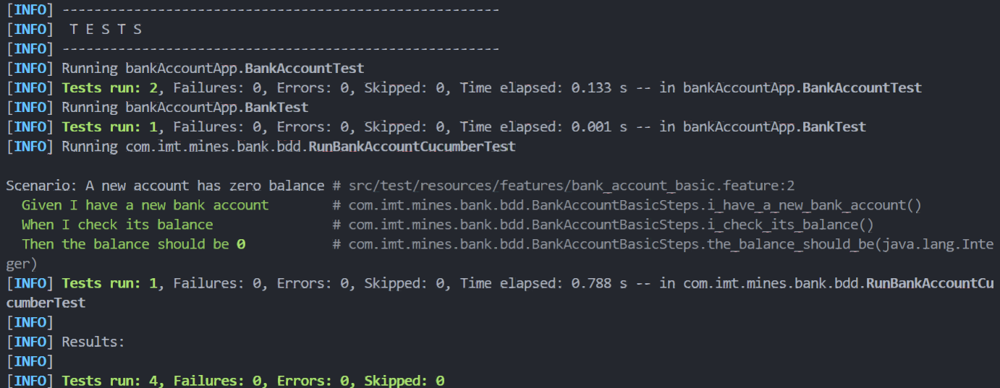

# Exercise 11 — Cucumber for BankAccount

## Objectif
Ajouter Cucumber au projet Maven pour écrire des tests BDD (Behavior-Driven Development) sur la classe `BankAccount`.

## Configuration

### Dépendances ajoutées au pom.xml
```xml
<dependency>
    <groupId>io.cucumber</groupId>
    <artifactId>cucumber-java</artifactId>
    <version>7.15.0</version>
    <scope>test</scope>
</dependency>
<dependency>
    <groupId>io.cucumber</groupId>
    <artifactId>cucumber-junit</artifactId>
    <version>7.15.0</version>
    <scope>test</scope>
</dependency>
```

### Structure créée
- **Feature file** : `src/test/resources/features/bank_account_basic.feature`
- **Runner** : `src/test/java/com/imt/mines/bank/bdd/RunBankAccountCucumberTest.java`
- **Step definitions** : `src/test/java/com/imt/mines/bank/bdd/BankAccountBasicSteps.java`

## Feature : Basic bank account behavior

```gherkin
Feature: Basic bank account behavior
  Scenario: A new account has zero balance
    Given I have a new bank account
    When I check its balance
    Then the balance should be 0
```

## Step Definitions

```java
package com.imt.mines.bank.bdd;

import static org.junit.Assert.assertEquals;
import bankAccountApp.BankAccount;
import io.cucumber.java.en.Given;
import io.cucumber.java.en.When;
import io.cucumber.java.en.Then;

public class BankAccountBasicSteps {
    private BankAccount account;
    private int observedBalance;

    @Given("I have a new bank account")
    public void i_have_a_new_bank_account() {
        account = new BankAccount();
    }

    @When("I check its balance")
    public void i_check_its_balance() {
        observedBalance = (int) account.getBalance();
    }

    @Then("the balance should be {int}")
    public void the_balance_should_be(Integer expected) {
        assertEquals(expected.intValue(), observedBalance);
    }
}
```

## Cucumber Runner

```java
package com.imt.mines.bank.bdd;

import org.junit.runner.RunWith;
import io.cucumber.junit.Cucumber;
import io.cucumber.junit.CucumberOptions;

@RunWith(Cucumber.class)
@CucumberOptions(
    features = "src/test/resources/features",
    glue = "com.imt.mines.bank.bdd",
    plugin = { "pretty" }
)
public class RunBankAccountCucumberTest {
    // Empty on purpose. JUnit + Cucumber will use the annotations above.
}
```

## Preuve d'exécution

Voici le screenshot montrant que `mvn test` exécute bien le scénario Cucumber avec succès :



## Résultats

**Tests run: 4** (2 tests BankAccountTest + 1 test BankTest + 1 scénario Cucumber)  
**Failures: 0**  
**Errors: 0**  
**Skipped: 0**  

Le scénario Cucumber "A new account has zero balance" s'exécute correctement :
- Given I have a new bank account
- When I check its balance
- Then the balance should be 0

**BUILD SUCCESS**
