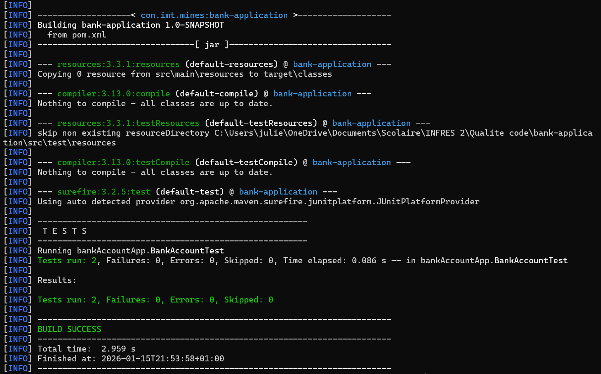

# Exercise 8 — Unit Tests for Bank Domain

## Classe testée
BankAccount

## Methodes testées
- `depositMoney(double amount)`
- `withdrawMoney(double amount)`

## Tests écrits

### Happy path
Dépôt de 100 → le solde augmente de 100.

```java
@Test
void depositMoney_happyPath() {
    BankAccount acc = new BankAccount();
    acc.depositMoney((double)100.0F);
    Assertions.assertEquals((double)100.0F, acc.getBalance(), 0.001);
}
```
### Tests
Retrait de 100 alors que le solde n'est que de 50 → l'opération échoue, le solde reste inchangé.
```java
@Test
void withdrawMoney_edgeCase_exceedsBalance() {
    BankAccount acc = new BankAccount();
    acc.depositMoney((double)50.0F);
    acc.setWithdrawLimit((double)500.0F);
    boolean result = acc.withdrawMoney((double)100.0F);
    Assertions.assertFalse(result);
    Assertions.assertEquals((double)50.0F, acc.getBalance(), 0.001);
}
```

## Preuve d’exécution des tests

Voici le screenshot montrant que `mvn test` s’est bien terminé avec **BUILD SUCCESS** :



Voici la capture d’écran montrant que la commande mvn test s’est bien terminée avec le message BUILD SUCCESS :

## Resultats
Tests exécutés via mvn test avec JUnit 5.

Tous les tests ont été validés avec succès.

Le build est propre.

## Conclusion
La logique métier principale de la classe BankAccount est désormais couverte par des tests unitaires