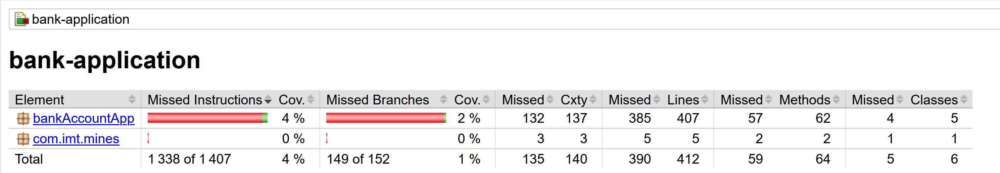
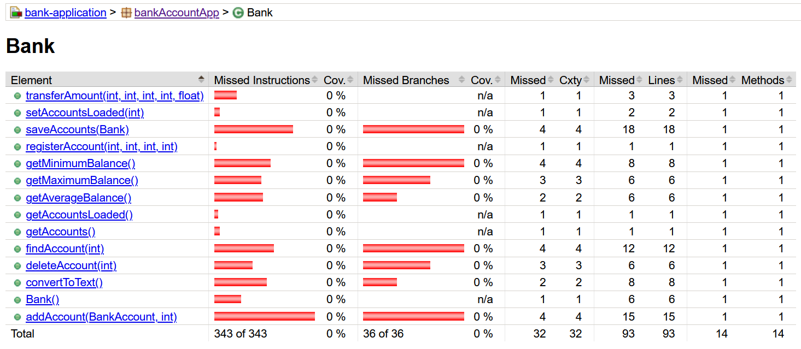
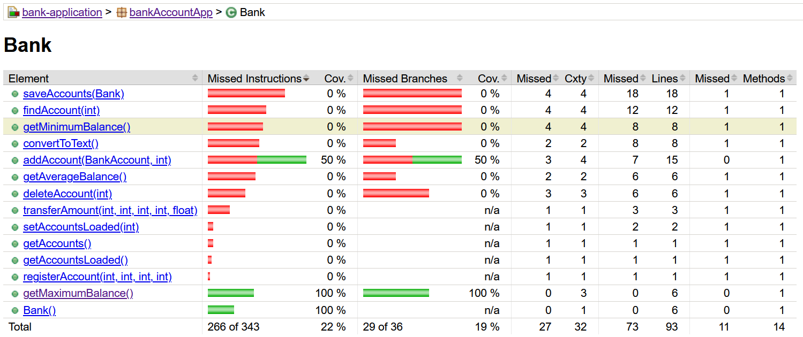

# Exercice 9 — Augmenter la couverture avec JaCoCo

## Objectif
Améliorer la couverture de tests du projet en identifiant une méthode non couverte, en écrivant un test unitaire, puis en vérifiant l’impact dans le rapport JaCoCo.

---

## Étape 1 — Génération du rapport JaCoCo

Commande exécutée :
```
mvn clean test
```

Le rapport JaCoCo a été généré dans :

```
target/site/jacoco/index.html
```

### Capture 1 — Vérification que JaCoCo fonctionne



---

## Étape 2 — Analyse du rapport

Dans le rapport, la classe **Bank** présentait une couverture de **0%**, toutes les méthodes étant non testées.

### Capture 2 — Classe *avant* ajout du test



---

## Étape 3 — Méthode ciblée

La méthode choisie pour augmenter la couverture est :

**`getMaximumBalance()` dans la classe `Bank`**

---

## Étape 4 — Test ajouté

Un test unitaire a été ajouté dans `BankTest.java` pour couvrir cette méthode.


```java
@Test
void getMaximumBalance_shouldReturnHighestBalance() {
    Bank bank = new Bank();

    BankAccount acc1 = new BankAccount();
    acc1.depositMoney(100);

    BankAccount acc2 = new BankAccount();
    acc2.depositMoney(300);

    BankAccount acc3 = new BankAccount();
    acc3.depositMoney(50);

    bank.addAccount(acc1, 0);
    bank.addAccount(acc2, 0);
    bank.addAccount(acc3, 0);

    assertEquals(300.0, bank.getMaximumBalance(), 0.001);
}
```

---

## Étape 5 — Vérification après ajout du test

Après avoir relancé :

```
mvn test
```

et rafraîchi le rapport JaCoCo, la méthode est passée en **vert**, et la couverture de la classe a augmenté.

### Capture 3 — Classe *après* ajout du test



---

## Conclusion

La couverture de tests du projet a été améliorée avec succès.  
La méthode ciblée est désormais testée, et le rapport JaCoCo confirme l’augmentation de couverture.
